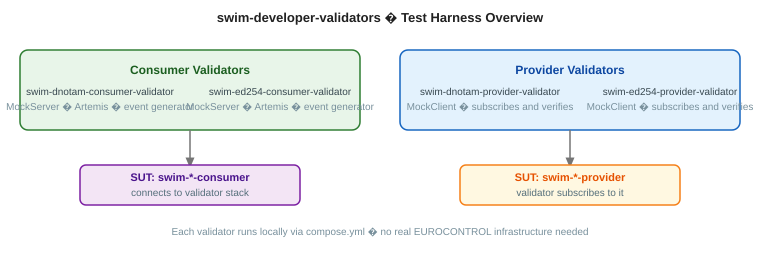

# swim-developer-validators



Shared infrastructure for building SWIM service validators. Provides the common components that validator applications need, fault injection, AMQP event generation, conformance testing, mTLS proxy, so that each validator only implements what is specific to its service.

## Modules

| Module | What it does |
|--------|-------------|
| [swim-validator-core](swim-validator-core/) | Fault injection, console notifications (SSE), XML randomizers, common DTOs |
| [swim-validator-consumer](swim-validator-consumer/) | Consumer-side base: subscription management, AMQP event generation, heartbeat publishing, persistence |
| [swim-validator-provider](swim-validator-provider/) | Provider-side base: mTLS HTTP proxy, JWT parsing, conformance test framework, AMQP message capture |

## Validator applications

| Validator | Role | Purpose |
|-----------|------|---------|
| [swim-dnotam-consumer-validator](swim-dnotam-consumer-validator/) | Fake provider | Tests DNOTAM Consumer implementations |
| [swim-dnotam-provider-validator](swim-dnotam-provider-validator/) | Fake consumer | Tests DNOTAM Provider implementations |
| [swim-ed254-consumer-validator](swim-ed254-consumer-validator/) | Fake provider | Tests ED-254 Consumer implementations |
| [swim-ed254-provider-validator](swim-ed254-provider-validator/) | Fake consumer | Tests ED-254 Provider implementations |

---

## GET STARTED

### Build the shared framework

Before building any validator application, install the parent and shared modules:

```bash
./mvnw clean install -DskipTests
```

This installs all modules to your local Maven repository, making them available as dependencies to the validator applications above.

### Run a specific validator

Each validator has its own `compose.yml` at its root. Navigate to the validator you need:

```bash
# To test a DNOTAM Consumer implementation
cd swim-dnotam-consumer-validator
podman compose up -d
./mvnw quarkus:dev

# To test a DNOTAM Provider implementation
cd swim-dnotam-provider-validator
podman compose up -d
./mvnw quarkus:dev
```

See each validator's README for the full list of services, ports, and configuration.

---

## Build and container images

All build operations run from this repository root.

```bash
make help          # list all available targets
make install       # build + install all modules to local Maven repo
make test          # unit + integration tests for all validators
```

Container images (all validators are built from this root):

```bash
make dnotam-consumer-validator-jvm      # JVM multi-arch image
make dnotam-provider-validator-jvm
make ed254-consumer-validator-jvm
make ed254-provider-validator-jvm

make dnotam-consumer-validator-native   # full native sequence (amd64 + arm64)
```

Override registry or tag: `make dnotam-consumer-validator-jvm REGISTRY=quay.io/myorg TAG=v1.2.3`

---

## How validators use this

A validator application (e.g. `swim-dnotam-consumer-validator`) declares this project as parent and depends on the module it needs:

```xml
<parent>
    <groupId>com.github.swim-developer</groupId>
    <artifactId>swim-validators</artifactId>
    <version>1.0.0-SNAPSHOT</version>
</parent>

<dependencies>
    <dependency>
        <groupId>com.github.swim-developer</groupId>
        <artifactId>swim-validator-consumer</artifactId>
    </dependency>
</dependencies>
```

---

## License

Licensed under the [Apache License 2.0](LICENSE).
